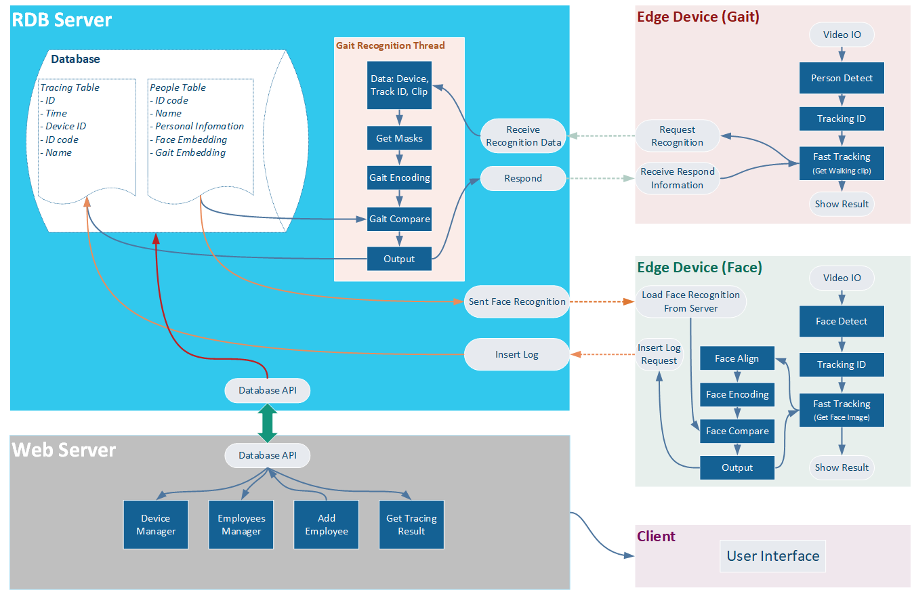

# Person Recognition by Face and Gait System for Time Keeping
***
  

## Author

This is graduation thesis - Computer Engineering  
The University of Danang - University of Science and Technology  
Student: ```Tran Chi Cuong, Le Thi Ngoc Yen```  
Instructor: ```Dr. Tran Thi Minh Hanh```  
Contact: ```cuongtran73d1@gmail.com```
***
## Summary
This repo contain source code of our system.  
Features:
- Face Log
- Gait Log
- Web application  

It runs on servers and edge devices
